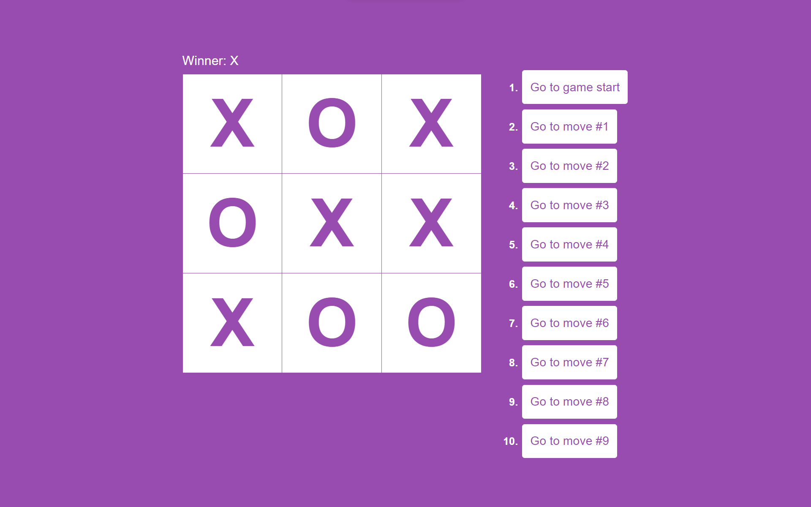
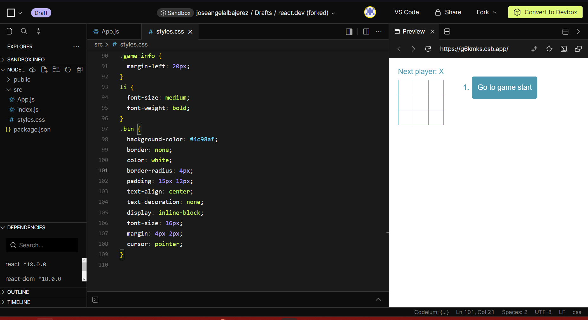

## Tutorial de Tic-Tac-Toe en React: Resumen de Pasos y Dudas


#### Jose Angel Alba 2022-0398



El tutorial de Tic-Tac-Toe en React proporciona una excelente introducción a los conceptos básicos de React al construir un juego funcional de Tic-Tac-Toe paso a paso. Aquí está un resumen de los pasos a seguir:

### Paso 1: Configuración del Entorno de Desarrollo

1. **Instalación de Node.js**: Asegúrate de tener Node.js instalado en tu sistema. Puedes descargarlo desde [la página oficial de Node.js](https://nodejs.org/).

2. **Crear una Aplicación React**: Utiliza el siguiente comando en tu terminal para crear un nuevo proyecto de React llamado "tic-tac-toe":

    ```bash
    npx create-react-app tic-tac-toe
    ```


3. **Descarga el Proyecto**: Descarga el proyecto desde CodeSanbox en el boton encima de la lista de directorios:

  

4. **Navegación al Directorio del Proyecto**: Cambia al directorio recién creado:

    ```bash
    cd tic-tac-toe
    ```

5. **Inicio del Servidor de Desarrollo**: Ejecuta el siguiente comando para iniciar el servidor de desarrollo:

    ```bash
    npm start
    ```

    Esto abrirá automáticamente una ventana del navegador con tu aplicación React en ejecución.

### Paso 2: Construcción del Tablero
Crea el componente Square que representa un cuadrado del tablero.

```bash
function Square({ value, onSquareClick }) {
  return (
    <button className="square" onClick={onSquareClick}>
      {value}
    </button>
  );
}
```
Utiliza el componente Board para representar el tablero completo, manejando los clics en los cuadrados y mostrando el estado actual del juego.

```bash

function Board({ xIsNext, squares, onPlay }) {
 
  return (
    <>
      <div className="status">{status}</div>
      <div className="board-row">
        <Square value={squares[0]} onSquareClick={() => handleClick(0)} />
        <Square value={squares[1]} onSquareClick={() => handleClick(1)} />
        <Square value={squares[2]} onSquareClick={() => handleClick(2)} />
      </div>
      <div className="board-row">
        <Square value={squares[3]} onSquareClick={() => handleClick(3)} />
        <Square value={squares[4]} onSquareClick={() => handleClick(4)} />
        <Square value={squares[5]} onSquareClick={() => handleClick(5)} />
      </div>
      <div className="board-row">
        <Square value={squares[6]} onSquareClick={() => handleClick(6)} />
        <Square value={squares[7]} onSquareClick={() => handleClick(7)} />
        <Square value={squares[8]} onSquareClick={() => handleClick(8)} />
      </div>
    </>
  );
}
```

### Paso 3: Implementación de la Lógica del Juego

Implementa la función handleClick en el componente Board para manejar los clics en los cuadrados del tablero.
```bash
function handleClick(i) {
    if (calculateWinner(squares) || squares[i]) {
      return;
    }
    const nextSquares = squares.slice();
    if (xIsNext) {
      nextSquares[i] = "X";
    } else {
      nextSquares[i] = "O";
    }
    onPlay(nextSquares);
  }
```

Utiliza la función calculateWinner para determinar si hay un ganador después de cada movimiento.
```bash
function calculateWinner(squares) {
  const lines = [
    [0, 1, 2],
    [3, 4, 5],
    [6, 7, 8],
    [0, 3, 6],
    [1, 4, 7],
    [2, 5, 8],
    [0, 4, 8],
    [2, 4, 6],
  ];
  for (let i = 0; i < lines.length; i++) {
    const [a, b, c] = lines[i];
    if (squares[a] && squares[a] === squares[b] && squares[a] === squares[c]) {
      return squares[a];
    }
  }
  return null;
}

// calculate winner llamado en el renderizado del board
  const winner = calculateWinner(squares);
  let status;
  if (winner) {
    status = "Winner: " + winner;
  } else {
    status = "Next player: " + (xIsNext ? "X" : "O");
  }
```

### Paso 4: Añadir la Funcionalidad de Retroceso

Implementa la función handlePlay en el componente Game para actualizar el historial de movimientos después de cada movimiento válido. Ademas,utiliza useState para gestionar el historial de movimientos y el estado actual del juego.
```bash
 
export default function Game() {
  const [history, setHistory] = useState([Array(9).fill(null)]);
  const [currentMove, setCurrentMove] = useState(0);
  const xIsNext = currentMove % 2 === 0;
  const currentSquares = history[currentMove];

  function handlePlay(nextSquares) {
    const nextHistory = [...history.slice(0, currentMove + 1), nextSquares];
    setHistory(nextHistory);
    setCurrentMove(nextHistory.length - 1);
  }


  

  return (
    <div className="game">
      <div className="game-board">
        <Board xIsNext={xIsNext} squares={currentSquares} onPlay={handlePlay} />
      </div>
      <div className="game-info">
        <ol>{moves}</ol>
      </div>
    </div>
  );
}

```


### Paso 5: Mostrar el Historial de Movimientos

Implementa la función jumpTo en el componente Game para permitir a los jugadores retroceder y avanzar en el historial de movimientos.
```bash
  function jumpTo(nextMove) {
    setCurrentMove(nextMove);
  }
```

Muestra una lista de botones de movimiento en el componente Game para que los jugadores puedan seleccionar cualquier paso anterior y continuar desde ese punto.
```bash
const moves = history.map((squares, move) => {
    let description;
    if (move > 0) {
      description = "Go to move #" + move;
    } else {
      description = "Go to game start";
    }
    return (
      <li key={move}>
        <button className="btn" onClick={() => jumpTo(move)}>
          {description}
        </button>
      </li>
    );
  });
```

---

## Dudas 
 ¿Cómo se utiliza el hook useState para manejar el estado del juego y los cuadrados del tablero?
 
 ¿Por qué es importante mantener la inmutabilidad al actualizar el estado en React? ¿Cómo se garantiza la inmutabilidad al manipular el estado del tablero?


